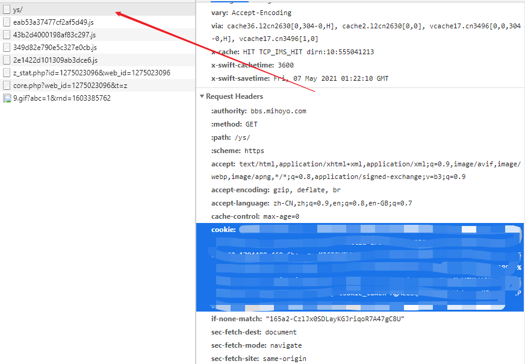
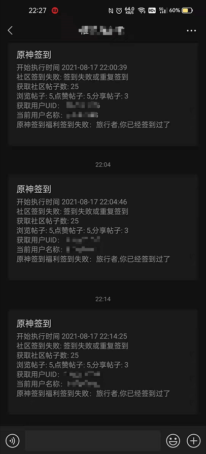

# 工具简介

米哈游MiHoYo原神签到福利、社区每日签到。

仓库地址：https://github.com/PonKing66/genshi-helper

> （最新版本（2.0.x）改动较大，建议重新拉取）

# 使用说明

## 获取cookie

- 浏览器打开https://bbs.mihoyo.com/ys/,登录账号。
- 按下F12并复制cookie



## 添加社区Cookie签到获取米哈币

**获取stoken,stuid （初次运行才需要）**
登录 https://bbs.mihoyo.com/ys/, 如果已经登录，需要退出再重新登录。

~~使用org.ponking.gih.util.GetstokenUtilsUtils工具类获取，添加cookie并启动~~

1. 使用Java -jar启动参数(-Dponking.gen.users=true)获取stoken,stuid(支持多账户，推荐)

   genshin-gen.properties：
    ```properties
    jerry=cookie1
    tom=cookie2
    spkie=cookie3
    ```

2. 运行,可获取genshin-users.yaml文件：
    ```shell
    java -jar -Dponking.gen.users=true GENSHIN_HELPER.jar genshin-gen.properties
    ```

   genshin-users.yaml内容大致如下：

    ```yaml
    jerry: { stoken: xxxxxxxxxxxxxxxxxxxxxxxxxxx, stuid: 'xxxxxxxxx' }
    tom: { stoken: xxxxxxxxxxxxxxxxxxxxxxxxxxxxx, stuid: 'xxxxxxxxx' }
    spkie: { stoken: xxxxxxxxxxxxxxxxxxxxxxxxxxx, stuid: 'xxxxxxxxx' }
    ```

## Linux Crontab定时任务执行
30 10 * * * sh /home/start.sh
**start.sh:**

```shell
#!/bin/bash
java -jar /home/GENSHIN-HELPER.jar "${你的cookie}" "${你的stuid}" "${你的stoken}"  >> /home/log/genshin-helper.log
# 注意cookies中含有等特殊字符,需要加上""
```

## 添加订阅执行结果

### [Server酱](http://sc.ftqq.com/9.version)

```shell
#!/bin/bash
java -jar /home/GENSHIN-HELPER.jar "${你的cookie}" "${你的stuid}" "${你的stoken}" "${你的sckey}">> /home/log/genshin-helper.log
# 注意cookies中含有等特殊字符,需要加上""
```

### 微信企业个人推送（推荐）



**新建微信企业教程：**

- 首先需要注册一个企业微信（https://work.weixin.qq.com/）。
- 进入管理后台，选择应用管理，然后选择创建应用。
- 创建好后，得到 AgentId 和 Secret 两个值，再回到企业微信后台，选择我的企业，翻到最底下，得到企业ID

```shell
#!/bin/bash
java -jar /home/GENSHIN-HELPER.jar "${你的cookie}" "${你的stuid}" "${你的stoken}" "${你的企业ID}" "${你的当前应用Secret}" "${你的当前应用AgentId}" >> /home/log/genshin-helper.log
# 注意cookies中含有等特殊字符,需要加上""
```

## yaml配置多账户

例：genshin-helper.yaml：

```yaml
mode: weixincp # 设置企业微信推送（serverChan:server酱,weixincp：企业微信）
sckey: # 仅需填写mode相关配置即可，如填写mode为weixincp，那么sckey不用填写
corpid: xxxxx
corpsecret: xxxxx
agentid: xxxxx
account:
   - cookie: cookie1
     stuid: stuid1
     stoken: stoken1
   - cookie: cookie2
     stuid: stuid2
     stoken: stoken2
```

```shell
#!/bin/bash
java -jar /home/GENSHIN-HELPER.jar genshin-helper.yaml >> /home/log/genshin-helper.log
# 注意cookies中含有等特殊字符,需要加上""
```
# 更新

- 添加线程优化
- 支持多账号获取cookie(stoken,stuid) 20210607
- 支持多账号签到

# 已知问题

- 部分贴子浏览签到失效（不打算修了）

# 感谢
- [genshin-auto-login](https://github.com/Viole403/genshin-auto-login)

- [BILIBILI-HELPER](https://github.com/JunzhouLiu/BILIBILI-HELPER)