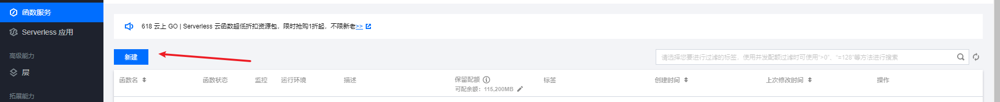
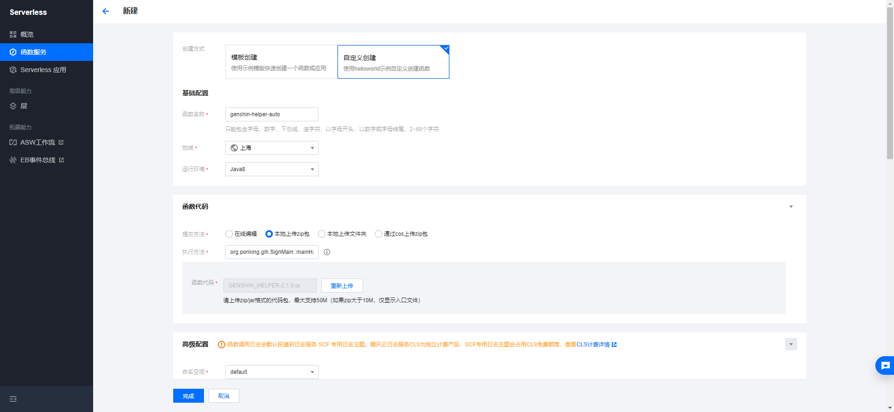
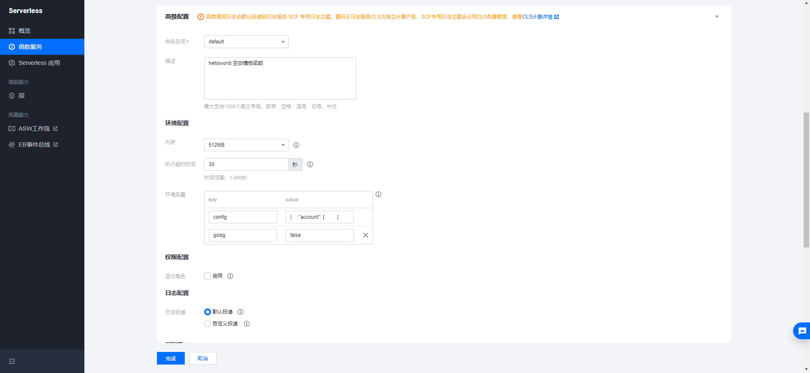
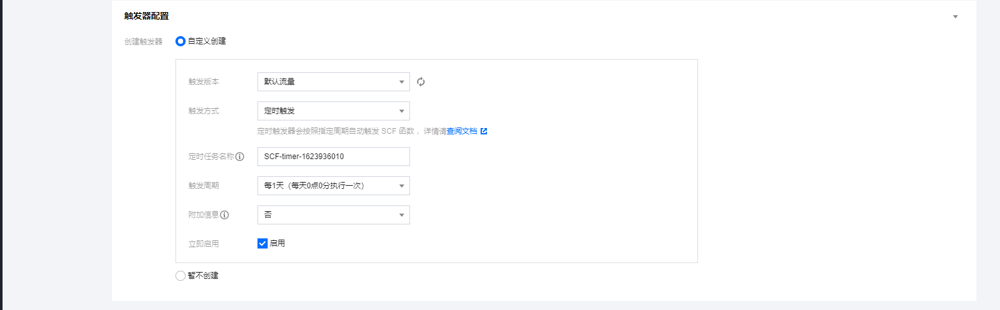

## 新建云函数



## 填写信息



**云函数暂不支持社区签到（反正无所谓，不送原石）**

- 基础信息
    - 函数名称(随便填写)： genshin-helper-auto
    - 运行环境勾选Java8

- 函数代码
    - 提交方法：本地上传zip包（请先下载最新的GENSHIN_HELPER.jar）
    - 执行方法：org.ponking.gih.SignMain::mainHandler

- 环境配置
    - 内存建议512M
    - 执行时间20（若多账号，执行时间提高）
    - 添加环境变量config={},gslog=false,config的value具体如下。

config的value格式:

```json
{
  "account": [
    {
      "cookie": "账号cookie"
    },
    {
      "cookie": "账号cookie"
    }
  ],
  "agentid": "xxxxxx",
  "corpid": "xxxxxxxx",
  "corpsecret": "xxxxxxxx",
  "mode": "不需要推送，可不填",
  "sckey": "xxxx"
}
```

如：

## 填写触发配置



自定义触发时间可填写, [参考链接](https://cloud.tencent.com/document/product/583/9708) 。

| Cron 表达式 | 表达式 | 
| :-----| ----: | 
| 0 0 12 * * * * |  每天中午12点触发 |
| 0 15 10 * * * * | 每天上午10:15触发  |

